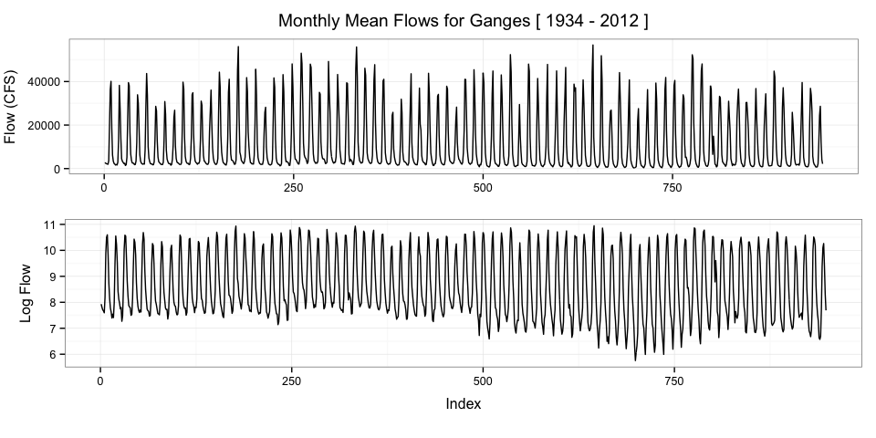
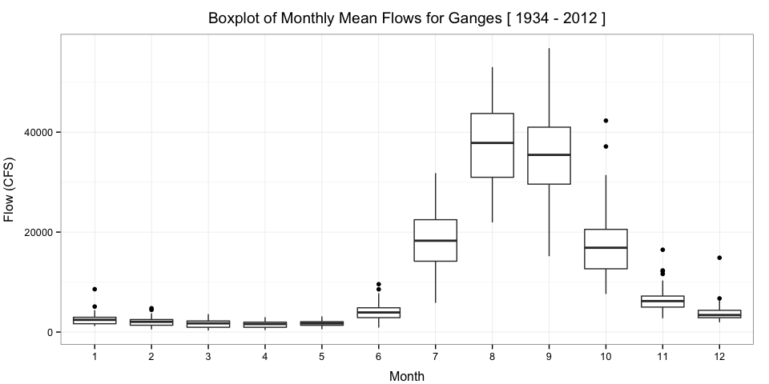
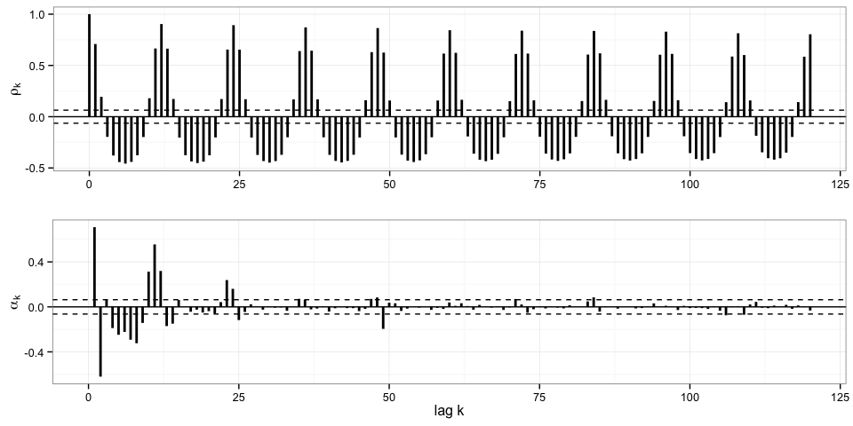

# Time Series Analysis
  

<script type="text/javascript" src="js/jquery.min.js"></script>
<script type="text/javascript" src="js/jquery-ui.min.js"></script>

<script type="text/javascript" src="https://cdn.rawgit.com/Kevin-M-Smith/BDA/master/Time%20Series%20Analysis/js/jquery.fancybox-1.3.4.pack.min.js"></script>
<script src="https://cdn.rawgit.com/Kevin-M-Smith/BDA/master/Time%20Series%20Analysis/js/jquery.tocify.js"></script>

<link type="text/css" rel="stylesheet" href="https://cdn.rawgit.com/Kevin-M-Smith/BDA/master/Time%20Series%20Analysis/css/jquery.tocify.css" />
<link rel="stylesheet" type="text/css" media="screen" href="https://cdn.rawgit.com/Kevin-M-Smith/BDA/master/Time%20Series%20Analysis/css/jquery.fancybox-1.3.4.css" />

<script src="https://cdn.rawgit.com/Kevin-M-Smith/scianimator/master/assets/js/jquery.scianimator.min.js"></script>

<head>
<div id="TOC" class="TOC"></div>

<style type="text/css">
  a.fancybox img {
    border: none;
    -o-transform: scale(1,1); -ms-transform: scale(1,1); -moz-transform: scale(1,1); -webkit-transform: scale(1,1); transform: scale(1,1); -o-transition: all 0.2s ease-in-out; -ms-transition: all 0.2s ease-in-out; -moz-transition: all 0.2s ease-in-out; -webkit-transition: all 0.2s ease-in-out; transition: all 0.2s ease-in-out;
  } 
a.fancybox:hover img {
  position: relative; z-index: 999; -o-transform: scale(1.03,1.03); -ms-transform: scale(1.03,1.03); -moz-transform: scale(1.03,1.03); -webkit-transform: scale(1.03,1.03); transform: scale(1.03,1.03);
}

#TOC {
  position: fixed;
  left: 0;
  top: 0;
  width: 250px;
  overflow:auto;
}

#source{
  position: fixed;
  left: 0;
  bottom: 0;
  width: 250px;
  overflow:auto;
}

body {
  float: left; 
  margin: auto;
  margin-left:300px;
  line-height: 20px;
}

p { line-height: 1.5; }

.fancybox-title-inside {
  margin-left: 0px !important;
}


</style>
</head>


<body>
  <script type="text/javascript">
  
  
  $(function($){
    $("#TOC").tocify({extendPage: true, selectors: "h1,h2,h3,h4"});
    var addToAll = true;
    var gallery = false;
    var titlePosition = 'inside';
    $(addToAll ? 'img' : 'img.fancybox').each(function(){
      var $this = $(this);
      var title = $this.attr('title');
      var src = $this.attr('data-big') || $this.attr('src');
      var a = $('<a href="#" class="fancybox"></a>').attr('href', src).attr('title', title);
      $this.wrap(a);
    });
    if (gallery)
      $('a.fancybox').attr('rel', 'fancyboxgallery');
    $('a.fancybox').fancybox({
      titlePosition: titlePosition
    });
  });
  
$.noConflict();

  
</script>

<script>
function toggle_R(){
$("pre").slideToggle(1);
setTimeout(function(){
$("div[data-unique*=" + $(".active")[0].getAttribute("data-unique") + "]")[0].scrollIntoView();
}, 100);

}
</script>


</body>

<div id="source" class="tocify"> 
<ul class="tocify-header nav nav-list">
<li class="tocify-item active" style="cursor: pointer;">
<a onclick='toggle_R();' >Show / Hide Source</a>
</li></ul>
</div>


<hr>

# Overview 
This project explores basic time series analysis techniques for two datasets. The first dataset is a complete record of the mean monthly flows of the Ganges from January 1934 to December 2013. The second dataset is a complete record of the mean monthly flows of the Nile (collected at Aswan Dam) from January 1871 to December 1984. 
<hr>
# The Ganges
## Monthly Flow

### Time Series
A plot of the monthly time series reveals seasonality in the data. This structure will need to be removed before we can assess the stationarity of the time series. 

```r
p1 = ggplot(dfg, aes(y=Flow, x=idx)) + geom_line() + theme_bw() 
p1 = p1 + ggtitle("Monthly Mean Flows for Ganges [ 1934 - 2012 ]")
p1 = p1 + xlab("") + ylab("Flow (CFS)")
p1 = p1 + theme(axis.title.y = element_text(vjust=1.5),
                axis.title.x = element_text(vjust=-0.5),
                plot.title = element_text(vjust=1.5)
                )


p11 = ggplot(dfg, aes(y=log(Flow), x=idx)) + geom_line() + theme_bw()
p11 = p11 + xlab("Index") + ylab("Log Flow")
p11 = p11 + theme(axis.title.y = element_text(vjust=1.5),
                axis.title.x = element_text(vjust=-0.5),
                plot.title = element_text(vjust=1.5)
                )

#p11 = p11 + geom_smooth(method = "loess", size = 1.5)
p11 = p11 + theme(plot.margin=unit(c(0,4,10,7),"mm"))

grid.arrange(p1, p11, nrow=2)
```

<b><p class="caption" align="center">Figure 1: 79 years of mean monthly flow data for the Ganges in real space (top) and log space (bottom).</p></b>
<br>

### Boxplots 
Within-year seasonality is highlighted in this boxplot of monthly mean flows. During the year there seems to be 'wet' and 'dry' seasons of differing lengths. These seasons will be independently analyzed in sections 3 and 4. 

```r
p2 = ggplot(dfg, aes(y=Flow, x=MID)) + geom_boxplot() + theme_bw()

p2 = p2 + ggtitle(paste("Boxplot of Monthly Mean Flows for Ganges [",
                   min(dfg$Year), 
                   "-",
                   max(dfg$Year),
                   "]"))

p2 = p2 + xlab("Month") + ylab("Flow (CFS)")
p2 = p2 + theme(axis.title.y = element_text(vjust=1.5),
                axis.title.x = element_text(vjust=-0.5),
                plot.title = element_text(vjust=1.5)
                )

p2
```

<b><p class="caption" align="center">Figure 2: A series of boxplots showing the center and spread of the dataset by month. The signal appears highly seasonal.</p></b>
<br>

### Sample Statistics

```r
pander(tab1, style = 'rmarkdown', justify='center')
```


|   &nbsp;    |  Mean (CFS)  |  SD (CFS)  |    CV     |
|:-----------:|:------------:|:----------:|:---------:|
|   January   |     2537     |    1124    |   0.443   |
|  February   |     2014     |   843.5    |  0.4189   |
|    March    |     1663     |   765.6    |  0.4603   |
|    April    |     1519     |   648.7    |   0.427   |
|     May     |     1758     |   574.2    |  0.3266   |
|    June     |     3988     |    1618    |  0.4057   |
|    July     |    18760     |    5860    |  0.3123   |
|   August    |    37200     |    8042    |  0.2162   |
|  September  |    35990     |    8399    |  0.2334   |
|   October   |    17370     |    6489    |  0.3735   |
|  November   |     6505     |    2291    |  0.3522   |
|  December   |     3762     |    1657    |  0.4406   |
| __Overall__ |  __11090__   | __13460__  | __1.214__ |

<br>

### Stationarity Assessment
The monthly time series is not even first-order stationary becuase the mean exhibits strong seasonality. However, the highly seasonal structure suggests that we may be able to make the time series stationary though differencing. The correlation at lag 12 is particularly strong, so let us begin there. 


```r
for(i in 1:12){
dfg.lag12 = rep(NA, length(dfg$Flow))
dfg.lag12[1:12==(i)] = dfg$Flow[1:12==(i)]
p1 = ggplot(dfg, aes(y=Flow, x=idx)) + geom_line() + theme_bw() + geom_point(aes(y=dfg.lag12))
p1 = p1 + ggtitle("Monthly Mean Flows for Ganges [ 1934 - 2012 ]")
p1 = p1 + xlab("Index") + ylab("Flow (CFS)")
p1 = p1 + theme(axis.title.y = element_text(vjust=1.5),
                axis.title.x = element_text(vjust=-0.5),
                plot.title = element_text(vjust=1.5)
                )
print(p1)
}
```


<div class="scianimator">
<div id="anim" style="display: inline-block;">
</div>
</div>
<script type="text/javascript">
  (function($) {
    $(document).ready(function() {
      var imgs = Array(12);
      for (i=0; ; i++) {
        if (i == imgs.length) break;
        imgs[i] = "body_files/figure-html/anim-" + (i + 1) + ".png";
      }
      $("#anim").scianimator({
          "images": imgs,
          "delay": 100,
          "controls": "none",
      });
      $("#anim").scianimator("play");
    });
  })(jQuery);
</script>
<b><p class="caption" align="center">Figure 3: Ganges monthly mean flows with _i_+12 observations highlighted.</p></b>


```r
q1 = ggacf(dfg$Flow) + xlab(" ") + theme(plot.margin=unit(c(2,2,2,2),"mm"))
q2 = ggpacf(dfg$Flow) + theme(plot.margin=unit(c(2,2,2,2),"mm"))

grid.arrange(q1, q2, nrow = 2)
```

<b><p class="caption" align="center">Figure 4: Total and partial correlograms for the monthly series.</p></b>

### Differencing
After differencing the series at lag 12, the mean appears stable. The partial 

```r
tsd = diff(dfg$Flow, 12)
tsd = data.frame(value = tsd, idx = dfg$idx[-1:-12])
p1 = ggplot(tsd, aes(y=value, x=idx)) + geom_line() + theme_bw() 
p1 = p1 + ggtitle("Differenced (d=12) Monthly Mean Flows for Ganges [ 1946 - 2012 ]")
p1 = p1 + xlab("Index") + ylab("Flow (CFS)")
p1 = p1 + theme(axis.title.y = element_text(vjust=1.5),
                axis.title.x = element_text(vjust=-0.5),
                plot.title = element_text(vjust=1.5)
)
p1
```

<b><p class="caption" align="center">Figure 5: Differenced (d=12) Monthly Mean Flow Series</p></b>


```r
q1 = ggacf(tsd$value) + xlab(" ") + theme(plot.margin=unit(c(2,2,2,2),"mm"))
q2 = ggpacf(tsd$value) + theme(plot.margin=unit(c(2,2,2,2),"mm"))
grid.arrange(q1, q2, nrow = 2)
```

<b><p class="caption" align="center">Figure 6: Total and partial correlograms for the differenced (d=12) series.</p></b>


### ARIMA
Here we con

```r
AIC =  matrix(ncol = 14, nrow = 14)
colnames(AIC) = paste('', 0:13, sep='')
rownames(AIC) = paste('', 0:13, sep='')

load("gAIC")

for(p in 0:13){
  for(q in 0:13){
    tryCatch({
      # a <- arima(tsd$value, order=c(p, 0, q))
      # if(exists("a")) AIC[q + 1, p + 1] <- floor(a$aic)
      
    }, error = function(cond){})
  }
}

pq = which(AIC == min(AIC), arr.ind=TRUE)
qbest = pq[,1]-1;
pbest = pq[,2]-1;

levelplot(t(AIC), panel=function(...) {
  arg <- list(...)
  panel.levelplot(...)
  panel.text(arg$x, arg$y, round(arg$z,1))
  panel.rect(xleft=pbest+0.5, xright=pbest+1.5, ytop=qbest+1.5, ybottom=qbest+0.5, lwd=4, border="red")
  },
  col.regions=colorRampPalette(brewer.pal(9,"Greys")[3:7])(25),
  xlab = "p",
  ylab = list("q", rot=0),
  main = "AIC")
```

 


```r
tsd.fit = arima(tsd$value, order=c(pbest, 0, qbest))

q1 = ggacf.th(tsd$value, fit = tsd.fit) + xlab(" ") + theme(plot.margin=unit(c(2,2,2,2),"mm"))
q2 = ggpacf.th(tsd$value, fit = tsd.fit) + theme(plot.margin=unit(c(2,2,2,2),"mm"))

grid.arrange(q1, q2, nrow = 2)
```

 


## ARIMA
